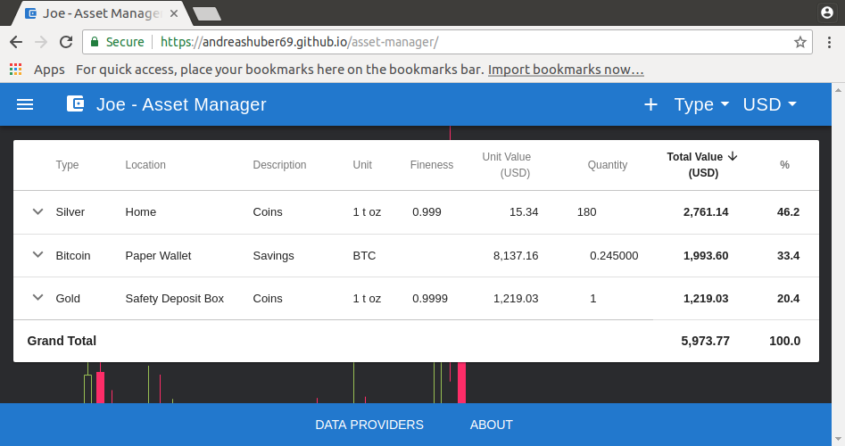

# Asset Manager

## Introduction

If you primarily invest in "unconventional" assets like precious metals and crypto currencies, it seems there are almost
no tools that would help you get an overview of your current financial situation.

Asset Manager aims to change that. In a nutshell, the application presents your precious metal and crypto currency
holdings in a groupable and sortable table, which allows you to quickly see how your net worth is spread among the
different asset types and locations.

## Getting Started

Asset Manager runs in your internet browser but works and feels much like a conventional desktop application. There are
no logins, no passwords and your data is only ever stored locally on your computer.

While the application should work in almost any recent internet browser, for privacy reasons it is recommended to
install either **Chromium** or **Firefox** and point it to <https://andreashuber69.github.io/asset-manager>. Note that I
only very rarely test the application in other browsers.

In the top toolbar on the left you'll find a menu with the usual suspects **New**, **Open...**, **Save** and
**Save As...**. On the right, you'll find a button to add a new asset and controls to change the asset grouping and the
valuation currency. Anything else is done in the table. Clicking on a row representing an asset group will
expand/collapse the group. Individual assets can be edited and deleted with the menu on the right. Some columns can be
sorted by clicking on their headers.

## Privacy

- **Data Storage**: The data you enter into Asset Manager is only ever stored locally in your browser and can be saved
  to a file on your hard drive.
- **Queries**: In general, Asset Manager only makes queries about precious metal prices and currency exchange rates
  (quandl.com) plus crypto currency prices (coinmarketcap.com). For crypto currencies, you have the option to also track
   your balance. Doing so requires sending your public address to an online service like e.g. blockchain.info.
- **Encryption**: All queries are always encrypted (https), but it should be noted that the owners of the respective
  services will of course have access to the contents of your query (which can be attributed to you via your IP
  address). If you have concerns about that, you should use a reputable VPN provider or even TOR.
- **Open Source**: You can only ever have a good idea of what a piece of software is doing, if the source code is
  available. This is why the Asset Manager source code along with the full change history is available at
  <https://github.com/andreashuber69/asset-manager>. Map files are deployed with the production code, so you can also
  easily review the code with the browser developer tools while your browser is directed to
  <https://andreashuber69.github.io/asset-manager>.