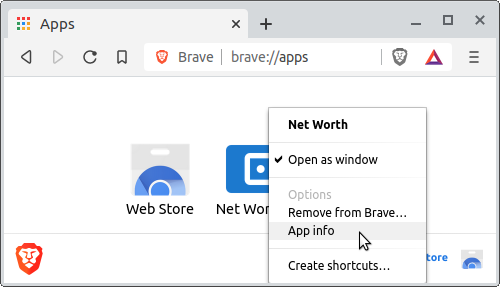
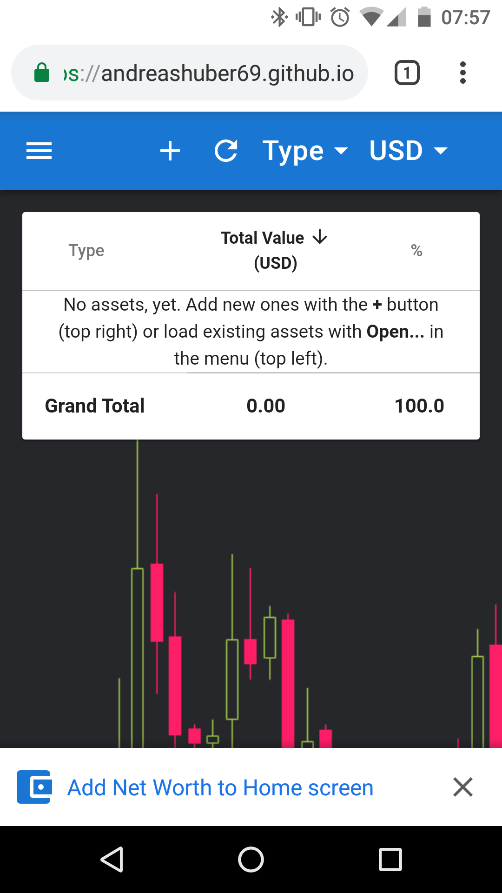
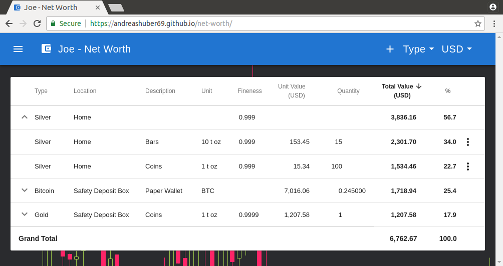

<h1 align="center">
  
</h1>

  
  
  
  
  
  
  
  

<h1 align="center">Net Worth</h1>
Copyright &copy; 2018-2020 Andreas Huber

Gain a quick overview of your precious metal and crypto assets!

If you primarily store your wealth in 'unconventional' assets like precious metals and cryptocurrencies, it seems
difficult to get an overview of your current financial situation.

Net Worth aims to make this a little easier. In a nutshell, the application presents your precious metal and
cryptocurrency holdings in a groupable and sortable table, which allows you to quickly see how your net worth is spread
among the different asset types and locations.

## Getting Started

Net Worth runs in your internet browser but works and feels mostly like a conventional desktop application. There are no
logins, no passwords and your data is only ever stored locally on your computer.

While the application should work in most recent internet browsers, for privacy reasons it is recommended to
install either [Brave](https://brave.com), [Iron](https://www.srware.net/iron/) or
[Firefox](https://www.mozilla.org/en-US/firefox/new/) and point it to <https://andreashuber69.github.io/net-worth>.

> Note: It appears that some versions of **Brave** treat requests to external services as if they are made by cross-site
> trackers. So, if you experience any problems, please deactivate **Brave Shields** and try again. In the
> [Privacy](#privacy) section you can find more information on what kinds of queries are made by the application.

### Installation

In the latest desktop versions of some browsers (e.g. **Brave** and **Chrome**), you have the option to install Net
Worth locally:

After the installation, you should see the application icon on your desktop. For further options, you can navigate to
`chrome://apps`:

Alternatively, you can also install the self-contained (i.e. browser-independent)
[desktop variant of Net Worth](https://github.com/andreashuber69/net-worth-desktop/blob/master/README.md#installation).

On recent **Android** phones (and presumably tablets) with the latest version of **Chrome**, you are automatically
prompted to add an icon to your home screen when you visit <https://andreashuber69.github.io/net-worth> for the first
time:

### Usage

In the toolbar on the left there's a menu with the usual suspects **New**, **Open...**, **Save**, **Save As...** and
**About**. On the right, you'll find buttons to add a new asset and refresh as well as controls to change the asset
grouping and the valuation currency.

In the table, clicking on a row representing an asset group will expand/collapse it. For example, in the screenshot
above, the **Silver** group is expanded, such that the grouped assets become visible. Individual assets can be edited
and deleted with the triple-dot menu at the end of each row. Some columns can be sorted by clicking on their headers.

Some table cells reveal more information when hovering over them with the mouse pointer:

- Location for a cryptocurrency: Address (if specified)
- Description: Notes (if specified)
- Unit Value and Quantity, when displaying "Error": Additional error information

### Privacy

- **Data Storage**: The data you enter into Net Worth is only ever stored locally and can, at your request, be saved to
  a file on your hard drive.
- **Queries**: The application queries precious metal prices and currency exchange rates
  ([quandl.com](https://quandl.com)) plus crypto currency prices ([cryptocompare.com](https://cryptocompare.com)). For
  crypto currencies, you have the option to also track your balance. If you choose to do so, the application will also
  send your public address(es) to an online service like e.g. [blockchain.info](https://blockchain.info).
- **Encryption**: All queries are always encrypted (https), but of course the owners of the respective services will
  have access to the contents of the queries (which can be attributed to you via your IP address). If you have concerns
  about that, you should use a reputable VPN provider or even TOR.

## Features

- Supported precious metals: **Silver**, **Palladium**, **Platinum**, **Gold**
- Supported crypto currencies: **Bitcoin**, **Monero**, **Litecoin**, **Ethereum Classic**, **ERC20 Tokens**,
  **Ethereum**, **Bitcoin Gold**, **Dash**, **Zcash**. Others will be implemented depending on demand.
- Assets can be grouped according to asset type or location.
- Assets other than precious metals and cryptos can be added as (manually valued) Misc assets.
- Liabilities can be added as negatively valued Misc assets.
- Supported valuation currencies: 27 fiat currencies plus silver ounces (XAG), gold ounces (XAU) and Bitcoin (BTC)
- Intuitive, flexible user interface that auto-adapts to almost any screen size.
- Free, open-source, no ads
- Works on almost any platform, including mobile phones and Raspberry Pis.

## Known Issues / Feedback

To see the known issues, ask questions, report problems or suggest improvements, please use the
[Net Worth Issue Tracker](https://github.com/andreashuber69/net-worth/issues).

## Source Code

The source code and full change history is available at <https://github.com/andreashuber69/net-worth> and
<https://github.com/andreashuber69/net-worth-desktop>. You can also review the code with the developer tools while your
browser is directed to the <https://andreashuber69.github.io/net-worth>.

## Rationale

Net Worth was created because no other freely available site/tool seemed to support both precious metals and crypto
currencies and I was fed up with maintaining an increasingly complex set of Excel sheets.

Net Worth is a so-called Progressive Web Application (PWA). PWAs can be used exactly like conventional web applications
but at the same time are automatically cached locally such that they still load in seconds if the network is slow or even
down. On an increasing number of browsers, especially on mobile platforms, PWAs can now also be added to the home screen
such that they look and feel much like a locally installed app.

The PWA model was chosen due to the following advantages over conventional desktop applications:

- PWAs work on most popular platforms/browsers.
- No installation is required, just surf to <https://andreashuber69.github.io/net-worth> and let your browser handle the
  rest.
- Distribution is straight-forward.

Of course, there are also some (minor) disadvantages:

- It is impossible to overwrite a local file from within a browser without user involvement. The **Save** menu item
  will therefore always create a new file rather than overwrite the originally loaded one. Since browsers typically
  store files in a special Download folder, the user usually needs to manually copy the newly saved file over the one
  she loaded. For an application like Net Worth this should not result in too much of an inconvenience, because files
  are typically changed rarely.
- If a web site attempts to open a new browser window, pop-up blockers sometimes get in the way. Most browsers allow the
  user to authorize exceptions.

## [License](https://raw.githubusercontent.com/andreashuber69/net-worth/develop/LICENSE)

## Technologies & Packages

  
  
  
  
  
  
  
  
  
  
  

